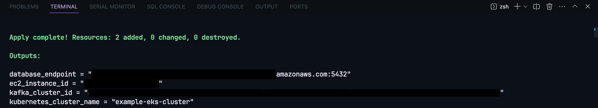

# Terraform AWS Infrastructure

This project uses Terraform to provision and manage AWS resources including EC2 instances, Kafka, Kubernetes, and an RDS instance. All these resources are connected together within a VPC.

## Architecture

The architecture includes the following components:

- EC2 instances: These are the virtual servers in Amazon's Elastic Compute Cloud (EC2) for running applications on the Amazon Web Services (AWS) infrastructure.
- Kafka: This is used for building real-time data pipelines and streaming apps.
- Kubernetes: This is an open-source system for automating deployment, scaling, and management of containerized applications.
- RDS instance: This is an easy to set up, operate, and scale a relational database in the cloud.
- VPC: This provides an isolated virtual network, where you can launch AWS resources in a virtual network that you define.

## Usage

To initialize the Terraform working directory and download the necessary provider plugins, run:

```bash
terraform init

# To create an execution plan, run:
terraform plan

# To apply the changes required to reach the desired state of the configuration, run:
terraform apply

# To destroy the Terraform-managed infrastructure, run:
terraform destroy
```

After running `terraform apply`, you should see the following output:

<!-- Image  -->


